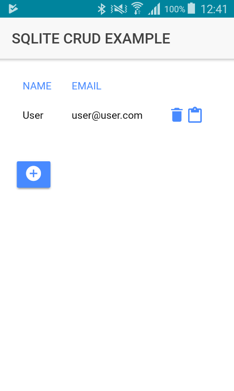

# ionic-crud-sqlite
Ionic app with SQLite CRUD methods example

Simple app that stores user objects (name, mail) on the native sqlite device db.
Lets you add, update and delete users.



ionic sqlite plugin
```bash
$ ionic cordova plugin add cordova-sqlite-storage
$ npm install --save @ionic-native/sqlite
```
